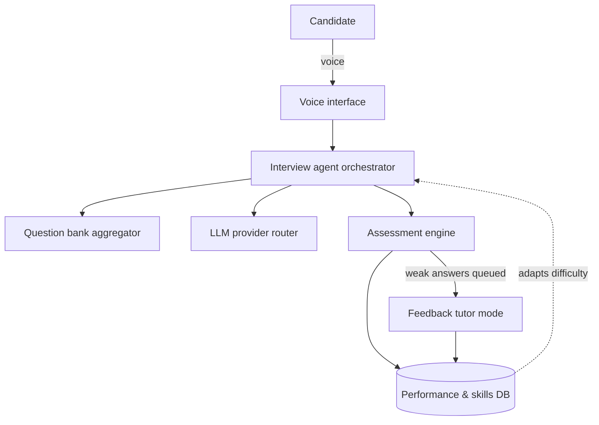
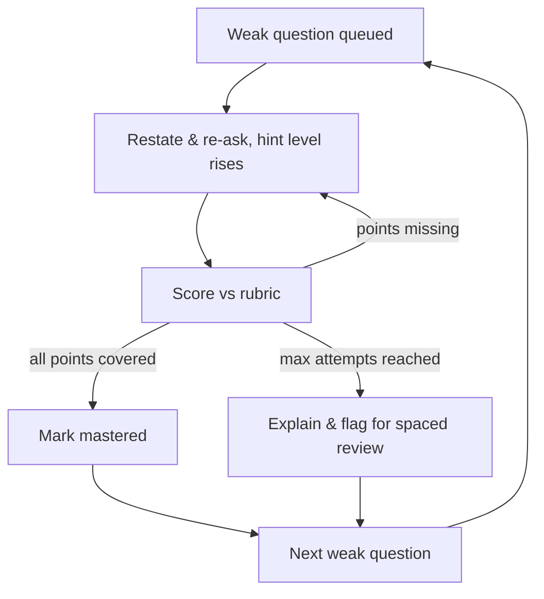
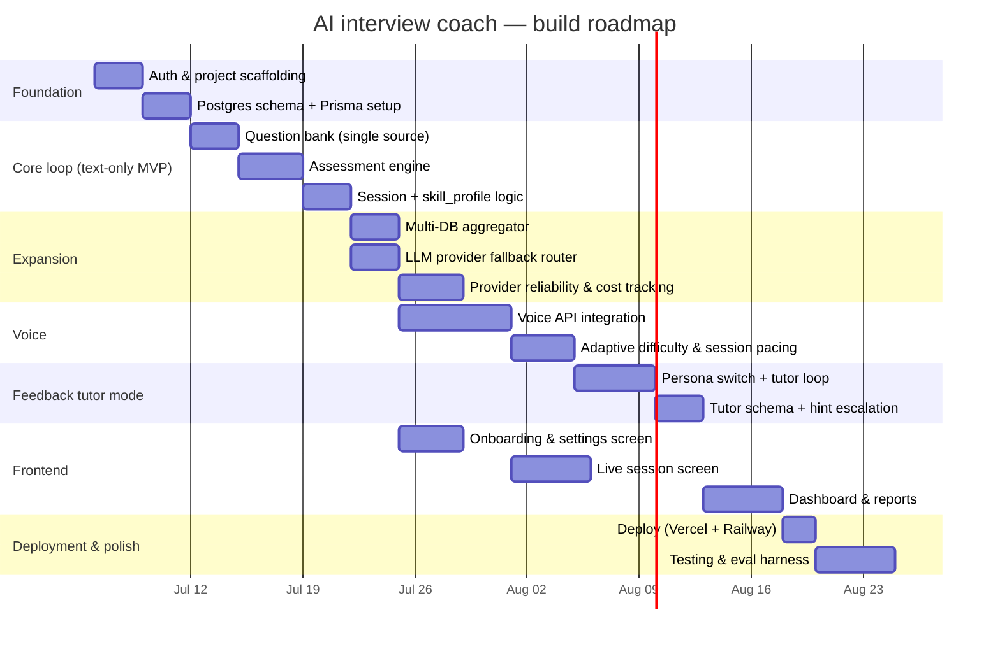

# AI interview coach — project documentation

## 1. Overview

A voice-driven AI agent that conducts mock interviews for **full-stack development**, **system design**, and **agentic AI** roles. The agent asks questions pulled from a self-owned question bank, classifies each answer in real time (correct / incorrect / misunderstood / evasive), adapts difficulty as the session progresses, and — once the interview phase ends — switches into a strict Socratic **feedback tutor mode** that drills weak answers until the candidate can produce them correctly. All performance data feeds a long-term skill profile so future sessions target the right weak spots.

**Assumptions**
- Single-user tool (you), not a multi-tenant product.
- You bring your own API keys (OpenAI, Gemini, OpenRouter); the system falls back across providers rather than failing when one is rate-limited or a free tier runs out.
- Voice is the primary interface; a text-only mode exists as the MVP path and as a fallback if voice providers are unavailable.

---

## 2. Architecture

### Interview loop



### Feedback tutor loop



---

## 3. Modules

| Module | Responsibility |
|---|---|
| **Voice interface** | Speech-to-speech session via OpenAI Realtime or Gemini Live; handles turn-taking, interruption, and live transcription. |
| **Interview agent (orchestrator)** | Drives the session state machine (`interviewing` → `tutoring` → `complete`), decides what to ask next, switches persona between interviewer and tutor. |
| **Question bank aggregator** | Queries the question tables (topic, difficulty, exclude-already-asked), normalizes results from multiple source tables into one shape. |
| **LLM provider router** | Routes reasoning calls across OpenAI / Gemini / OpenRouter with fallback; single place all other modules call instead of hitting an SDK directly. |
| **Assessment engine** | Classifies each answer against a per-question rubric via structured LLM output: `correct \| incorrect \| partial \| misunderstood \| evasive`. |
| **Feedback tutor mode** | Strict, Socratic re-ask loop over every non-correct answer; escalating hints, capped attempts, graceful "explain and flag" exit. |
| **Performance & skill profile** | Aggregates classifications into per-topic mastery scores; the memory that makes future sessions adaptive. |
| **Auth** | Single-user JWT auth guarding all API endpoints. |
| **Provider health & cost tracking** | Distinguishes expired-key vs rate-limit vs outage failures; circuit breaker with cooldown; logs token/cost usage per call so free-tier limits are avoided proactively. |
| **Adaptive difficulty & pacing** | Per-topic difficulty tier (1–5) adjusted after each answer; session segmentation for voice providers with short session caps. |
| **Frontend (Next.js)** | Onboarding/settings, live session screen (transcript + phase indicator), dashboard with mastery trends and session history. |

---

## 4. Tech stack

| Layer | Choice | Notes |
|---|---|---|
| Backend | **NestJS** (TypeScript) | Modules map 1:1 to the table above |
| Frontend | **Next.js** (App Router) | Onboarding, live session UI, dashboard |
| Database | **Postgres** + **Prisma** | pgvector extension optional, added post-MVP for question dedup / semantic retrieval |
| Voice | **OpenAI Realtime API** or **Gemini Live API** | Behind a shared interface so either can be swapped in |
| LLM routing | **OpenRouter** (fallback array) or custom retry chain | Used for reasoning/assessment calls, not voice |
| Auth | **JWT** via `@nestjs/passport` + `@nestjs/jwt` | Single user, no social login needed |
| Monorepo tooling | **Nx** or **Turborepo** | `apps/api`, `apps/web` |
| Deployment | Vercel (frontend) + Railway/Render (backend, DB) | Backend needs a persistent process for the WebSocket voice gateway — not serverless |
| CI | GitHub Actions | Lint + test on PR; platforms auto-deploy on merge |

---

## 5. Database schema

```
users(id, email, password_hash, created_at)

questions(id, source_db, topic, subtopic, difficulty, prompt,
          rubric_points[], tags[], embedding vector(1536) NULL, last_refreshed_at)

sessions(id, user_id, started_at, ended_at, field, phase, status,
         target_duration_minutes, questions_planned)

session_segments(id, session_id, provider, started_at, ended_at, resumed_from_id)

session_answers(id, session_id, question_id, transcript,
                classification, confidence, reasoning,
                follow_up_asked, timestamp)

skill_profile(user_id, topic, subtopic,
              correct_count, incorrect_count, misunderstood_count, evasive_count,
              mastery_score, current_difficulty, last_seen_at)

tutor_attempts(id, session_id, question_id, attempt_number,
               hint_level, transcript, missing_points[],
               resolved boolean, resolved_via ENUM(self, explained), timestamp)

session_reports(id, session_id, summary, strengths[], weaknesses[],
                recommended_topics[], generated_at)

provider_usage(id, provider, model, session_id,
               tokens_in, tokens_out, audio_seconds, cost_usd, created_at)

provider_health(provider, status, consecutive_failures, cooldown_until,
                last_error, updated_at)
```

---

## 6. Project structure

```
apps/
  api/                        NestJS
    src/
      auth/                   JWT login, guards
      questions/               aggregator, seeding, embeddings (post-MVP)
      sessions/                lifecycle, pacing, segmentation
      assessment/               rubric scoring, classification
      tutor/                    persona switch, retry loop, hint escalation
      provider-router/          LLM fallback across providers
      provider-health/          circuit breaker, usage/cost logging
      voice/                    WebSocket gateway, ephemeral token issuance
      skill-profile/            mastery score aggregation
  web/                          Next.js (App Router)
    app/
      login/
      onboarding/                topic, difficulty, session length, voice/text toggle
      interview/                 live session — mic capture, transcript, phase indicator
      dashboard/                  mastery trends, recent sessions
      reports/[id]/              end-of-session summary
prisma/
  schema.prisma
```

---

## 7. Development approach

Build in this order — each phase is runnable on its own before the next begins:

1. **Foundation** — auth, Postgres schema, Prisma setup.
2. **Core loop (text-only MVP)** — single question source, assessment engine, session + skill profile logic. Validates the classification and scoring logic without audio complexity.
3. **Expansion** — multi-DB aggregator, LLM provider fallback router, provider health/cost tracking.
4. **Voice** — integrate OpenAI Realtime / Gemini Live behind the shared interface; add adaptive difficulty and session pacing/segmentation.
5. **Feedback tutor mode** — persona switch, Socratic retry loop, tutor schema.
6. **Frontend** — onboarding, live session screen, dashboard/reports.
7. **Deployment & polish** — Vercel + Railway/Render deploy, testing, and (optional) an eval harness to validate the assessment engine's grading accuracy over time.

---

## 8. Roadmap (Gantt)



Roughly **8–9 weeks** end to end at a steady solo pace, with the text-only MVP usable after ~2 weeks.

---

## 9. Open items for later

- **pgvector** — add once the question pool is large enough to need dedup or semantic "more like this" retrieval. Not required for MVP.
- **Eval harness** — a way to periodically validate the assessment engine's grading against known-correct answers, so rubric drift is caught early.
- **Agentic AI content refresh** — this topic moves fast; the question-generation job should refresh it more often than full-stack/system-design.
